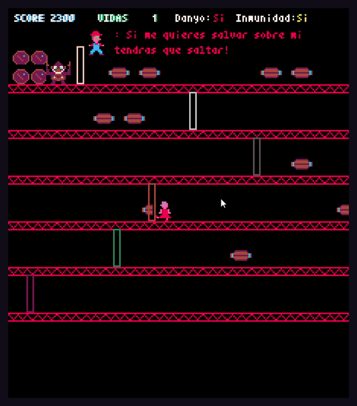
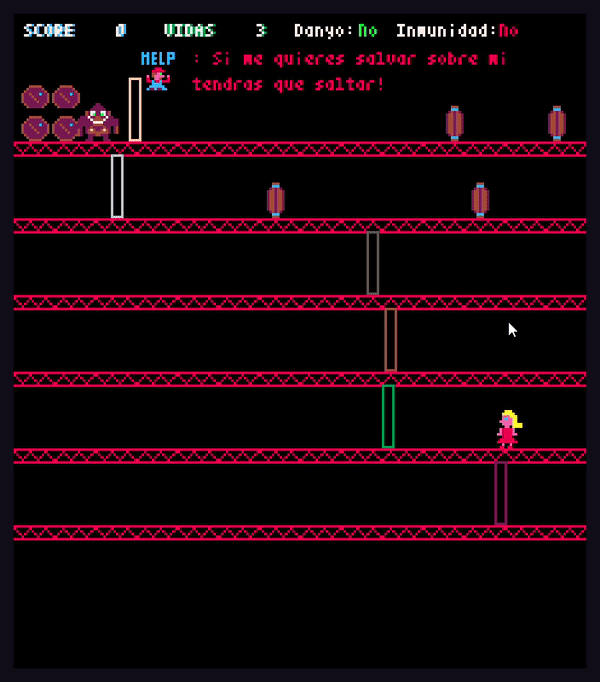

# Donkey Kong and Mario videogame

This is the first version of a video game made by the python library pyxel: https://github.com/kitao/pyxel.

This time is Mario who is being saved by Peach.  


The logic of the game is basic, barrels going down either by the floors or the stairs( which are generated randomly).

The idea was just to learn python and try to code a simple and fun game in python. Excuse the mistakes which can be found

**Any help or improved is welcomed, so don't be afraid and join in! :)**


### To take into account!!!!

The game is unfinished, although it can be played.
As a matter of code, you will find:

1. Missing docstring.
2. Comments in other languages (spanish).
3. Functions without use or obsolete functions

As a matter of code, you will find missing docstring and some comments in other languages (spanish).


## What will you find?

Peach.py -> This class encloses the logic of the hero 

Barrel.py -> This class encloses the logic of the "Enemies"

Constants.py -> File to declare the variables 

Board.py -> Class where the logic of the main game is written also it serves as the main executioner of the program.

assets/characters.pyrex -> Where the animations are made

## How to install it? 

With the requirements which brings with him:

```bash 
pip install -r "requirements.txt"
```

## How to play it?

The main file or the file to be executed is **Board.py**. To run the game just type:

```bash
python3 Board.py
```

## Which are the controls?

move peach -> :arrow_left:  :arrow_up: :arrow_right:

Jump -> **Space Bar**

## Wanna see??

​				**Dying**



​			*Take care when dodging the barrels, if you are hit by one, your hair will turn black, as consequence you will be granted immunity for 5 seconds. :)*

​				**Wining**



## What can be improved?

1. Jumping movement.
2. Going upstairs or downstairs.
3. Peach being hitting by a barrel ( Being more precise).
4. Additional objects ( Flame balls or Hammers ).
5. The score and the way of rewarding points.
6. Set the floors in diagonal.
7. Menu of intro and exit.
8. Music .
9. Better animations.


## Final Notes and releases

It would the nicest thing if this game has helped you in some way or if you have used it or improved in your personal projects just to mention my name or leave a comment.

Thanks a lot!
